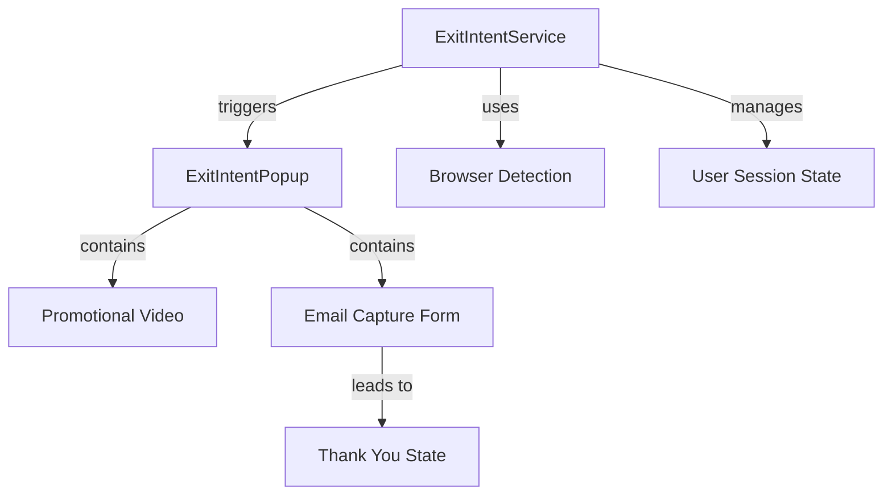

# Exit Intent System - Implementation Guide

## Overview

The Exit Intent System is a critical component of the Video Training Funnel website, designed to capture leads when users are about to leave the site. This document provides detailed technical guidance for implementing each aspect of the exit intent system, ensuring it works effectively across both desktop and mobile platforms while maintaining a positive user experience.

## Table of Contents

1. [System Architecture](#system-architecture)
2. [Exit Detection Logic](#exit-detection-logic)
3. [Popup Overlay Component](#popup-overlay-component)
4. [Video Integration](#video-integration)
5. [Email Capture Form](#email-capture-form)
6. [Thank You Flow](#thank-you-flow)
7. [User Experience Considerations](#user-experience-considerations)
8. [Testing Strategy](#testing-strategy)
9. [Performance Considerations](#performance-considerations)

## System Architecture

The Exit Intent System consists of several interconnected components:



### Component Structure

1. **ExitIntentService.js**: Core service that handles detection logic
2. **ExitIntentPopup.jsx**: Modal overlay component 
3. **EmailCaptureForm.jsx**: Form component for lead capture
4. **VideoPlayer.jsx**: Reused from existing implementation, with autoplay settings

## Exit Detection Logic

### Desktop Implementation

For desktop users, implement cursor position tracking to detect when the mouse moves toward the top of the browser window:

```javascript
// ExitIntentService.js - Desktop detection snippet
export function setupDesktopExitDetection(callback) {
  const handleMouseLeave = (e) => {
    // Check if the mouse is leaving through the top of the page
    if (e.clientY <= 0) {
      callback();
    }
  };
  
  // Add event listener
  document.addEventListener('mouseleave', handleMouseLeave);
  
  // Return cleanup function
  return () => {
    document.removeEventListener('mouseleave', handleMouseLeave);
  };
}
```

Key considerations:
- Include a small buffer zone (5-10px) to avoid false triggers
- Implement throttling to prevent multiple triggers
- Use session storage to prevent re-triggering within the same session

### Mobile Implementation

For mobile devices, use a combination of:

1. **Timer-based approach**: Trigger after a period of inactivity (e.g., 30 seconds)
2. **Scroll direction**: Detect rapid scrolling up (potential exit gesture)
3. **Page visibility**: React to app switching or tab changing

```javascript
// ExitIntentService.js - Mobile detection snippet
export function setupMobileExitDetection(callback, inactivityTime = 30000) {
  let timer;
  let lastScrollTop = 0;
  const scrollThreshold = 50; // Pixels
  const fastScrollSpeed = 15; // Pixels per frame
  
  // Reset timer on user activity
  const resetTimer = () => {
    clearTimeout(timer);
    timer = setTimeout(() => {
      callback();
    }, inactivityTime);
  };
  
  // Track scroll direction and speed
  const handleScroll = () => {
    const st = window.pageYOffset || document.documentElement.scrollTop;
    
    // Fast scroll up detection
    if (st < lastScrollTop && (lastScrollTop - st > scrollThreshold)) {
      callback();
    }
    
    lastScrollTop = st <= 0 ? 0 : st;
    resetTimer();
  };
  
  // Set up event listeners
  document.addEventListener('touchstart', resetTimer);
  document.addEventListener('touchmove', resetTimer);
  document.addEventListener('scroll', handleScroll);
  
  // Initialize timer
  resetTimer();
  
  // Return cleanup function
  return () => {
    clearTimeout(timer);
    document.removeEventListener('touchstart', resetTimer);
    document.removeEventListener('touchmove', resetTimer);
    document.removeEventListener('scroll', handleScroll);
  };
}
```

Key considerations:
- Adapt sensitivity for different device types
- Account for touch interactions
- Avoid disrupting the natural user flow

### Device Detection

Implement browser and device detection to apply the appropriate strategy:

```javascript
// Device detection helper
export function isMobileDevice() {
  return /Android|webOS|iPhone|iPad|iPod|BlackBerry|IEMobile|Opera Mini/i.test(navigator.userAgent) || 
         window.innerWidth <= 768;
}
```

## Popup Overlay Component

Implement the `ExitIntentPopup.jsx` component as a modal dialog that appears when exit intent is detected:

```jsx
// ExitIntentPopup.jsx - Component structure
import React, { useState, useEffect, useRef } from 'react';
import VideoPlayer from '../video/VideoPlayer';
import EmailCaptureForm from '../forms/EmailCaptureForm';
import './ExitIntentPopup.css';

function ExitIntentPopup({ isOpen, onClose, videoSrc }) {
  const [isSubmitted, setIsSubmitted] = useState(false);
  const [videoPlaying, setVideoPlaying] = useState(true);
  const popupRef = useRef(null);
  
  // Handle ESC key
  useEffect(() => {
    const handleEsc = (e) => {
      if (e.key === 'Escape') onClose();
    };
    
    if (isOpen) {
      document.addEventListener('keydown', handleEsc);
    }
    
    return () => {
      document.removeEventListener('keydown', handleEsc);
    };
  }, [isOpen, onClose]);
  
  // Focus trap and accessibility
  useEffect(() => {
    // Focus management code
  }, [isOpen]);
  
  // Handle form submission
  const handleFormSubmit = (formData) => {
    // Submit form data to API (implement in Phase 6)
    console.log('Form submitted:', formData);
    setIsSubmitted(true);
  };
  
  if (!isOpen) return null;
  
  return (
    <div className="exit-intent-overlay" aria-modal="true" role="dialog">
      <div className="exit-intent-popup" ref={popupRef}>
        <button className="close-button" onClick={onClose} aria-label="Close popup">
          &times;
        </button>
        
        {!isSubmitted ? (
          <>
            {/* Popup content when form not yet submitted */}
            <h2>Before You Go!</h2>
            <div className="popup-video-container">
              <VideoPlayer 
                autoPlay={true} 
                initialVolume={0.5} 
                src={videoSrc} 
                onPlayingChange={setVideoPlaying}
              />
            </div>
            <p className="incentive-message">Sign up to get our free training resource</p>
            <EmailCaptureForm onSubmit={handleFormSubmit} />
          </>
        ) : (
          <>
            {/* Thank you content after submission */}
            <h2>Thank You!</h2>
            <p>Your resource is on its way to your inbox.</p>
            <button className="cta-button" onClick={onClose}>Continue Browsing</button>
          </>
        )}
      </div>
    </div>
  );
}

export default ExitIntentPopup;
```

### CSS Considerations

Create `ExitIntentPopup.css` with proper styling:

```css
/* ExitIntentPopup.css - Key styling aspects */
.exit-intent-overlay {
  position: fixed;
  top: 0;
  left: 0;
  width: 100%;
  height: 100%;
  background-color: rgba(0, 0, 0, 0.75);
  display: flex;
  justify-content: center;
  align-items: center;
  z-index: var(--z-index-modal);
  animation: fadeIn 0.3s ease-out;
}

.exit-intent-popup {
  background-color: var(--color-white);
  border-radius: var(--border-radius-lg);
  padding: var(--spacing-xl);
  max-width: 90%;
  width: 600px;
  max-height: 90vh;
  overflow-y: auto;
  box-shadow: 0 5px 15px rgba(0, 0, 0, 0.3);
  position: relative;
  animation: slideIn 0.4s ease-out;
}

/* Animations */
@keyframes fadeIn {
  from { opacity: 0; }
  to { opacity: 1; }
}

@keyframes slideIn {
  from { transform: translateY(-50px); opacity: 0; }
  to { transform: translateY(0); opacity: 1; }
}

/* Close button */
.close-button {
  position: absolute;
  top: var(--spacing-sm);
  right: var(--spacing-sm);
  background: none;
  border: none;
  font-size: 1.5rem;
  cursor: pointer;
  color: var(--color-dark);
  z-index: 1;
}

/* Mobile responsiveness */
@media (max-width: 767px) {
  .exit-intent-popup {
    width: 90%;
    padding: var(--spacing-lg);
  }
}
```

## Video Integration

Configure the VideoPlayer component for use in the exit intent popup:

1. Use the existing VideoPlayer component with specific props
2. Set `autoPlay={true}` and `initialVolume={0.5}` as required
3. Ensure the video is concise (30-60 seconds) and compelling

Key considerations:
- Size the video appropriately for the popup
- Ensure video doesn't autoplay until popup is visible
- Handle video pause when form is submitted

## Email Capture Form

Implement a dedicated `EmailCaptureForm.jsx` component:

```jsx
// EmailCaptureForm.jsx
import React, { useState } from 'react';
import './EmailCaptureForm.css';

function EmailCaptureForm({ onSubmit }) {
  const [email, setEmail] = useState('');
  const [firstName, setFirstName] = useState('');
  const [errors, setErrors] = useState({});
  const [isSubmitting, setIsSubmitting] = useState(false);
  
  const validateForm = () => {
    const newErrors = {};
    
    // Email validation
    if (!email) {
      newErrors.email = 'Email is required';
    } else if (!/^[A-Z0-9._%+-]+@[A-Z0-9.-]+\.[A-Z]{2,}$/i.test(email)) {
      newErrors.email = 'Invalid email address';
    }
    
    // First name validation (optional)
    if (firstName && firstName.length < 2) {
      newErrors.firstName = 'Name must be at least 2 characters';
    }
    
    setErrors(newErrors);
    return Object.keys(newErrors).length === 0;
  };
  
  const handleSubmit = async (e) => {
    e.preventDefault();
    
    if (validateForm()) {
      setIsSubmitting(true);
      try {
        // In Phase 6, this would connect to the backend API
        // For now, just simulate a successful submission
        await new Promise(resolve => setTimeout(resolve, 800));
        onSubmit({ email, firstName });
      } catch (error) {
        setErrors({ form: 'Submission failed. Please try again.' });
      } finally {
        setIsSubmitting(false);
      }
    }
  };
  
  return (
    <form className="email-capture-form" onSubmit={handleSubmit}>
      {errors.form && <div className="error-message form-error">{errors.form}</div>}
      
      <div className="form-group">
        <label htmlFor="firstName">First Name (optional)</label>
        <input
          type="text"
          id="firstName"
          value={firstName}
          onChange={(e) => setFirstName(e.target.value)}
          className={errors.firstName ? 'error' : ''}
          placeholder="Your first name"
        />
        {errors.firstName && <div className="error-message">{errors.firstName}</div>}
      </div>
      
      <div className="form-group">
        <label htmlFor="email">Email Address *</label>
        <input
          type="email"
          id="email"
          value={email}
          onChange={(e) => setEmail(e.target.value)}
          className={errors.email ? 'error' : ''}
          placeholder="your.email@example.com"
          required
        />
        {errors.email && <div className="error-message">{errors.email}</div>}
      </div>
      
      <button 
        type="submit" 
        className="submit-button" 
        disabled={isSubmitting}
      >
        {isSubmitting ? 'Sending...' : 'Get Free Training'}
      </button>
      
      <p className="privacy-note">
        We respect your privacy and will never share your information.
      </p>
    </form>
  );
}

export default EmailCaptureForm;
```

Style the form appropriately in `EmailCaptureForm.css`.

## Thank You Flow

Implement two levels of thank-you confirmation:

1. **Inline confirmation** - Displayed within the popup after form submission
2. **Dedicated page** - Full ThankYouPage component for post-conversion experience

### Session Management

Implement session/cookie management to prevent showing the popup multiple times to the same user:

```javascript
// Storage helper for exit intent
export function hasSeenExitIntent() {
  return localStorage.getItem('exitIntentShown') === 'true';
}

export function markExitIntentShown() {
  localStorage.setItem('exitIntentShown', 'true');
  // Set expiration if needed
}
```

## User Experience Considerations

1. **Frequency capping**: Don't show more than once per session
2. **Timing**: Wait at least 10-15 seconds after page load before enabling
3. **Scroll depth**: Consider requiring minimum scroll depth (e.g., 25%) before triggering
4. **Context awareness**: Don't trigger when user is actively engaging with content
5. **Mobile experience**: Be especially careful on mobile to avoid disruption

## Testing Strategy

Test the exit intent system thoroughly across various scenarios:

1. **Browser compatibility**: Chrome, Firefox, Safari, Edge
2. **Device testing**: Desktop, tablet, various mobile devices
3. **Interaction paths**: Test each interaction path through the exit intent flow
4. **Form validation**: Test all form error states and validation rules
5. **A/B testing**: Consider setting up variant testing to optimize:
   - Video content length
   - Form fields required
   - Messaging copy
   - Timing of popup display

## Performance Considerations

1. **Lazy loading**: Load exit intent resources only when needed
2. **Throttling**: Throttle mouse movement event listeners
3. **Cleanup**: Properly remove event listeners when not needed
4. **Resource optimization**: Ensure video used in popup is properly compressed
5. **Animation rendering**: Use GPU-accelerated animations for smooth transitions

## Implementation Steps

1. Create service and utility files:
   - `services/ExitIntentService.js`
   - `services/StorageService.js` (for cookie/localStorage helpers)

2. Create UI components:
   - `components/forms/EmailCaptureForm.jsx`
   - `components/forms/ExitIntentPopup.jsx`

3. Integrate exit intent system into the application:
   - Add hooks into `App.js` to initialize exit intent detection
   - Configure context for managing exit intent state
   - Connect form submissions to the future API (placeholder for Phase 6)

4. Implement analytics tracking for measuring effectiveness:
   - Track popup impressions
   - Track form submissions
   - Track video engagement in the popup

## Conclusion

The Exit Intent System is a crucial lead generation component of the Video Training Funnel website. By following this implementation guide, you'll create a system that effectively captures leads while maintaining a positive user experience across all devices. The key is to balance business needs (lead capture) with user experience considerations.