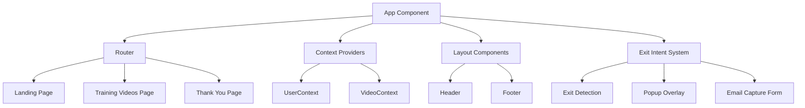
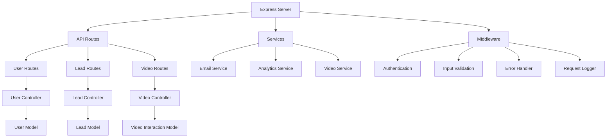
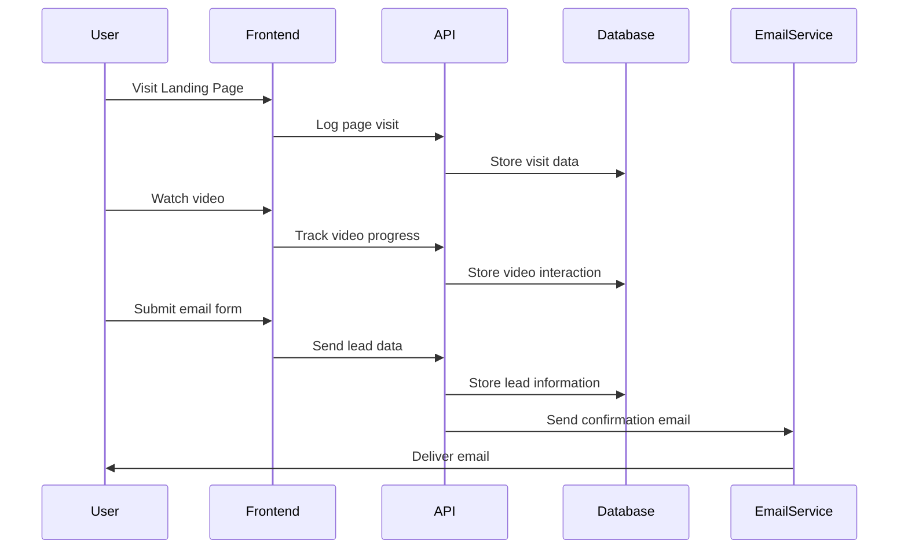

# Video Training Funnel Website - Implementation Plan

## Overview

This document outlines the comprehensive implementation strategy for the Video Training Funnel website, as described in the README. This plan focuses on creating a professional React/Node.js web application with structured video training content, email capture capabilities, and exit intent functionality, all while ensuring responsive design across desktop and mobile platforms.

## Table of Contents

1. [Architecture Overview](#architecture-overview)
2. [Component Structure](#component-structure)
3. [Implementation Phases](#implementation-phases)
4. [Technical Specifications](#technical-specifications)
5. [Integration Points](#integration-points)
6. [Testing Strategy](#testing-strategy)
7. [Deployment Process](#deployment-process)
8. [Maintenance Guidelines](#maintenance-guidelines)

## Architecture Overview

### Frontend Architecture



### Backend Architecture



## Component Structure

### Pages

#### Landing Page
- **Hero Section**
  - Headline component
  - Subheadline component
  - CTA button with smooth-scroll functionality
  - Responsive layout (desktop & mobile versions)

- **Video Introduction Section**
  - Video player component with auto-play
  - Custom volume controls
  - Progress navigation
  - Scroll-triggered playback

- **Call-to-Action Section**
  - Value proposition content
  - CTA button linking to training videos
  - Social proof elements (testimonials)

#### Training Videos Page
- Sequential video display
- Custom video player
- Progress tracking
- Unique CTA buttons per video
- Dual CTA layout after final video

#### Thank You Page
- Confirmation message
- Next steps guidance
- Additional resources

### Reusable Components

#### Layout Components
- Header with navigation
- Footer with links and copyright
- Section dividers

#### Video Components
- Video player with custom controls
- Video progress indicator
- Video navigation

#### Form Components
- Email capture form
- Form validation
- Submit handling

#### UI Components
- CTA buttons
- Testimonial slider
- Countdown timer
- Section dividers

#### Exit Intent System
- Exit detection logic
- Modal popup
- Video player
- Email capture form

## Implementation Phases

### Phase 1: Setup & Environment ✅
- [x] Initialize project repositories
- [x] Set up directory structure
- [x] Install required dependencies
- [x] Configure development environment
- [x] Create local development server
- [ ] Set up version control (Git)
- [ ] Configure linting and code formatting

**Deliverables:**
- ✅ Complete project structure
- ✅ Working development environment
- ✅ Configured build system
- ✅ Basic documentation

### Phase 2: Core Frontend Framework ✅
- [x] Create page layouts
- [x] Set up React Router
- [x] Implement responsive design framework
- [x] Create context providers (UserContext, VideoContext)
- [x] Implement layout components (header, footer)
- [x] Set up shared hooks (useVideoPlayer, useScrollPosition)

**Deliverables:**
- ✅ Basic navigation structure
- ✅ Page templates
- ✅ Responsive layout system
- ✅ Shared state management

### Phase 3: Landing Page Implementation ✅
- [x] Implement hero section with responsive design
- [x] Create video introduction section with auto-play
- [x] Build scroll-based video triggering
- [x] Develop call-to-action section with compelling design
- [x] Implement smooth scrolling between sections

**Deliverables:**
- ✅ Complete landing page
- ✅ Responsive design for all devices
- ✅ Functioning video and scroll interactions
- ✅ Working CTA buttons

### Phase 4: Video Training Page Implementation ✅
- [x] Develop video player component with custom controls
- [x] Create sequential video navigation system
- [x] Implement progress tracking
- [x] Design and implement CTA buttons for each video
- [x] Create dual CTA layout for the final video

**Deliverables:**
- ✅ Complete training video page
- ✅ Functioning video player
- ✅ Working navigation between videos
- ✅ Responsive layout for mobile and desktop

### Phase 5: Exit Intent System 🔄
- [ ] Implement exit detection algorithm
  * Create `ExitIntentService.js` in the services directory
  * Implement mouse position tracking for desktop (detect exit through top of page)
  * Add timer-based detection for mobile devices (after X seconds of inactivity)
  * Create event listeners that can be attached/detached as needed
  * Implement throttling to avoid performance issues

- [ ] Create popup overlay with responsive design
  * Create `ExitIntentPopup.jsx` component
  * Design background overlay with semi-transparent backdrop
  * Implement modal container with responsive sizing
  * Add close button and escape key functionality
  * Ensure accessibility with proper focus management and aria attributes
  * Add entrance/exit animations using CSS transitions

- [ ] Develop auto-playing promotional video
  * Integrate VideoPlayer component with autoplay capability
  * Set initial volume to 50% per requirements
  * Include concise, compelling promotional content
  * Ensure video is properly sized for all devices

- [ ] Build email capture form with validation
  * Create form component with controlled inputs
  * Implement client-side validation (required fields, email format)
  * Add submission handling with loading state
  * Include clear value proposition messaging
  * Display appropriate error messages
  * Design success state for valid submissions

- [ ] Design and implement thank-you confirmation flow
  * Create transition to thank-you state within popup
  * Add option to navigate to full thank-you page
  * Implement cookie/local storage to prevent showing popup again to the same user
  * Ensure proper data collection for analytics

**Deliverables:**
- Working exit intent detection on both desktop and mobile
- Responsive overlay design with smooth transitions
- Functioning email capture with validation
- Complete user flow from detection to thank-you message

### Phase 6: Backend Development
- [ ] Set up Express server
- [ ] Configure MongoDB connection
- [ ] Create data models (User, Lead, VideoInteraction)
- [ ] Implement API routes
- [ ] Develop controllers for data manipulation
- [ ] Set up email service integration
- [ ] Implement analytics tracking

**Deliverables:**
- Functioning API endpoints
- Data storage and retrieval
- Email notification system
- Analytics tracking implementation

### Phase 7: Integration & Testing
- [ ] Connect frontend to backend API
- [ ] Implement end-to-end user flows
- [ ] Test on multiple devices and browsers
- [ ] Optimize performance
- [ ] Fix bugs and issues
- [ ] Conduct user testing

**Deliverables:**
- Fully integrated application
- Comprehensive test results
- Performance optimization report
- Bug fixes documentation

### Phase 8: Deployment & Documentation
- [ ] Set up production environment
- [ ] Configure CI/CD pipeline
- [ ] Deploy frontend and backend
- [ ] Create user documentation
- [ ] Prepare technical documentation
- [ ] Conduct final testing in production

**Deliverables:**
- Deployed application
- CI/CD pipeline
- Complete documentation
- Production monitoring setup

## Technical Specifications

### Frontend Technologies
- **Framework**: React 18+
- **State Management**: 
  - Context API for UI state
  - React Query for server state
- **Routing**: React Router v6+
- **Styling**: CSS Modules / Tailwind CSS
- **Media Handling**: HTML5 Video API
- **Form Handling**: Formik or React Hook Form
- **Validation**: Yup or Zod

### Backend Technologies
- **Framework**: Express.js
- **Database**: MongoDB
- **ORM**: Mongoose
- **Authentication**: JWT
- **Email**: Nodemailer
- **Validation**: Joi
- **Logging**: Winston

### Responsive Design
See [RESPONSIVE-DESIGN-PLAN.md](./RESPONSIVE-DESIGN-PLAN.md) for detailed responsive design specifications, including:
- Breakpoint strategy
- Component-specific adaptations
- Testing methodology
- Maintenance guidelines

### Performance Targets
- **Page Load Time**: < 2s on 4G connections
- **Time to Interactive**: < 3s
- **First Content Paint**: < 1.5s
- **Lighthouse Score**: 90+ in all categories
- **Video Start Time**: < 1s after trigger

## Integration Points

### Frontend-Backend Integration
- **API Endpoints**: RESTful API with JSON payloads
- **Authentication**: JWT tokens via Authorization header
- **File Uploads**: Multipart form data with progress tracking
- **Real-time Updates**: Polling or WebSockets (if needed)

### Third-Party Services Integration
- **Email Service**: SMTP integration via Nodemailer
- **Analytics**: Custom tracking or Google Analytics
- **Video Hosting**: Local or cloud storage (AWS S3, etc.)
- **Payment Processing**: (If applicable) Stripe/PayPal

### Data Flows



## Testing Strategy

### Unit Testing
- Component testing with Jest and React Testing Library
- API endpoint testing with Supertest
- Model and controller testing

### Integration Testing
- End-to-end testing with Cypress
- API integration testing
- Database integration testing

### Responsive Testing
- Cross-browser testing (Chrome, Firefox, Safari, Edge)
- Mobile device testing (iOS, Android)
- Tablet testing
- See [RESPONSIVE-DESIGN-PLAN.md](./RESPONSIVE-DESIGN-PLAN.md) for detailed testing methodology

### Performance Testing
- Lighthouse audits
- Web Vitals monitoring
- Load testing with k6 or similar
- Video performance metrics

## Deployment Process

### Development Environment
- Local development with hot reloading
- Docker containers for consistent environments
- MongoDB running locally or in container

### Staging Environment
- Cloud-based staging server
- CI/CD pipeline integration
- Automated testing on deploy
- Replica of production database structure

### Production Environment
- High-availability cloud hosting
- Load balancing for API servers
- CDN for static assets
- Database clustering and backups
- Monitoring and alerting

## Maintenance Guidelines

### Code Organization
- Follow component-based architecture
- Maintain separation of concerns
- Document complex logic
- Keep files under 500 lines

### Documentation Requirements
- Component documentation with usage examples
- API documentation with request/response formats
- Setup and deployment instructions
- Troubleshooting guides

### Update Process
1. Create feature branch from development
2. Implement changes with tests
3. Submit pull request with documentation
4. Code review and approval
5. Merge to development and test
6. Deploy to staging and validate
7. Deploy to production with monitoring

### Performance Monitoring
- Regular Lighthouse audits
- User-centric metrics tracking
- Server monitoring
- Error logging and alerting

### Backup Strategy
- Database daily backups
- Code repository backups
- Configuration backups
- Disaster recovery plan

## LLM Query Guidelines

When using AI tools like this one for ongoing development support, follow these guidelines from [RESPONSIVE-DESIGN-PLAN.md](./RESPONSIVE-DESIGN-PLAN.md):

### Query Construction
- Include project context
- Specify the current phase and component
- Reference specific technical requirements

### Examples of Effective Queries

```
"For the Video Training Funnel project, help implement the exit intent detection 
logic as specified in Phase 5 of IMPLEMENTATION-PLAN.md, ensuring it works 
correctly on both desktop and mobile platforms."
```

```
"I'm implementing the video player component for the Training Videos Page. Based 
on the specifications in IMPLEMENTATION-PLAN.md and RESPONSIVE-DESIGN-PLAN.md, 
how should I adapt the controls for touch interfaces while maintaining the same 
visual design?"
```

```
"According to our implementation plan, I need to connect the Email Capture Form 
to the backend API. Can you help me implement the form submission logic that 
aligns with the API endpoints defined in Phase 6 of IMPLEMENTATION-PLAN.md?"
```

### Maintaining Context
- Reference previous implementation decisions
- Link to relevant documentation files
- Specify the current implementation phase
- Include any constraints or requirements