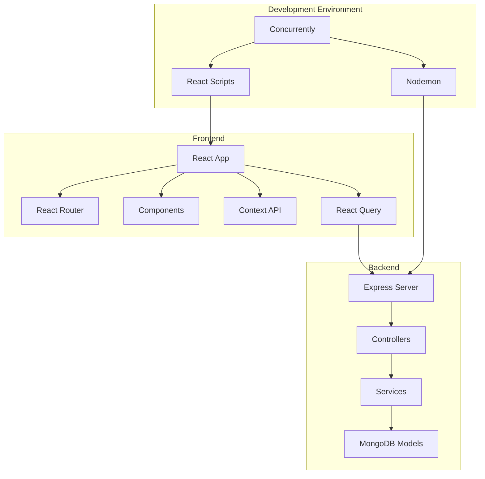

# Video Training Funnel Website - Implementation Summary

## Architecture & Planning Completed

We have successfully architected and planned the Video Training Funnel Website project with a comprehensive set of documentation and a functional local development environment. This summary serves as a guide to navigate the documentation and understand the next steps for implementation.

## Documentation Overview

| Document | Purpose | Key Contents |
|----------|---------|--------------|
| [DEVELOPMENT.md](./DEVELOPMENT.md) | Development environment setup instructions | Installation steps, running the dev server |
| [LOCAL-DEVELOPMENT-SETUP.md](./LOCAL-DEVELOPMENT-SETUP.md) | Detailed development server implementation | Architecture, configuration, error handling |
| [RESPONSIVE-DESIGN-PLAN.md](./RESPONSIVE-DESIGN-PLAN.md) | Responsive design strategy | Breakpoints, component adaptations, testing |
| [IMPLEMENTATION-PLAN.md](./IMPLEMENTATION-PLAN.md) | Phase-by-phase implementation plan | 8 implementation phases with deliverables |
| [TESTING-PLAN.md](./TESTING-PLAN.md) | Comprehensive testing strategy | Test types, environments, methodologies |
| [TECHNICAL-ARCHITECTURE-DETAILED.md](./TECHNICAL-ARCHITECTURE-DETAILED.md) | Technical specifications | System architecture, data models, API design |

## Current Implementation Status

We have completed the following phases from the implementation plan:

### Phase 1: Setup & Environment ✅

- ✅ Project structure created with frontend and backend directories
- ✅ Basic package.json files configured for both frontend and backend
- ✅ Required dependencies installed
- ✅ Local development server setup with concurrently
- ✅ Minimal backend Express server implemented
- ✅ Frontend React application initialized
- ✅ API proxying configured

### Phase 2: Core Frontend Framework ✅

- ✅ React Router setup for SPA navigation between pages
- ✅ Responsive design framework implemented with CSS variables
- ✅ Context providers created (UserContext, VideoContext)
- ✅ Layout components (Header, Footer) implemented with responsive design
- ✅ Shared hooks created (useVideoPlayer, useScrollPosition)

### Phase 3: Landing Page Implementation ✅

- ✅ Hero section with headline, subheadline and CTA button
- ✅ Video Introduction section with embedded VideoPlayer component
- ✅ Call-to-Action section structure with link to training videos
- ✅ Scroll-based triggering system using IntersectionObserver API

### Phase 4: Video Training Page Implementation ✅

- ✅ Sequential video presentation using the VideoContext
- ✅ VideoPlayer integration for training content
- ✅ Navigation controls for moving between videos
- ✅ Dynamic CTA buttons (single CTA for videos 1-3, dual CTA for final video)

## Development Environment

The local development server has been set up with the following features:

- **Frontend**: React development server with hot reloading (port 3000)
- **Backend**: Express server with automatic restart via nodemon (port 3001)
- **Orchestration**: Concurrent execution of both servers via a root package.json
- **API Proxy**: Requests from frontend to `/api/*` are proxied to backend

To start the development environment:

```bash
# From the project root
npm run dev
```

## Next Steps

According to our [IMPLEMENTATION-PLAN.md](./IMPLEMENTATION-PLAN.md), the next phase to implement is **Phase 5: Exit Intent System**.

To support this phase, we've created a detailed technical guide: [EXIT-INTENT-IMPLEMENTATION.md](./EXIT-INTENT-IMPLEMENTATION.md). This document provides:

1. **Comprehensive System Architecture**
   - Component structure for the exit intent system
   - Integration points with existing components

2. **Detailed Implementation Code**
   - Exit detection logic for both desktop and mobile
   - Popup overlay component structure and styling
   - Email capture form with validation
   - Thank you flow implementation

3. **User Experience Guidelines**
   - Frequency capping recommendations
   - Timing and contextual awareness
   - Mobile-specific considerations

4. **Testing and Performance Optimization**
   - Cross-browser and device testing strategy
   - Performance considerations for smooth operation

When implementing Phase 5, refer to this dedicated guide alongside the general implementation plan to ensure a robust and user-friendly exit intent system that effectively captures leads while maintaining a positive user experience.

## Implementation Approach

For efficient implementation, we recommend:

1. **Mode Switching**: Switch to Code mode to implement the core functionality
2. **Progressive Implementation**: Follow the phases outlined in IMPLEMENTATION-PLAN.md
3. **Mobile-First Development**: Implement responsive components following RESPONSIVE-DESIGN-PLAN.md
4. **Test-Driven Development**: Write tests alongside implementation following TESTING-PLAN.md
5. **Architecture Adherence**: Follow the architecture patterns in TECHNICAL-ARCHITECTURE-DETAILED.md

## Architecture Overview



## Technical Decisions

Key technical decisions made in the architecture:

1. **State Management**: Using Context API for UI state and React Query for server state
2. **Responsive Design**: Breakpoint-based with component-level adaptations
3. **API Structure**: RESTful API with consistent response format
4. **Database**: MongoDB with Mongoose for schema definition
5. **Authentication**: JWT-based authentication
6. **Development Workflow**: Concurrent servers with hot reloading

## Getting Started with Implementation

To begin implementing the next phase:

1. Review all documentation to understand the complete architecture
2. Start the development server to ensure the environment is working
3. Switch to Code mode to implement the core frontend framework
4. Follow the implementation plan phases sequentially
5. Regularly test on multiple viewports to ensure responsive design

## Resources

- React Documentation: https://react.dev/
- Express Documentation: https://expressjs.com/
- MongoDB Documentation: https://docs.mongodb.com/
- React Query Documentation: https://tanstack.com/query/latest
- React Router Documentation: https://reactrouter.com/