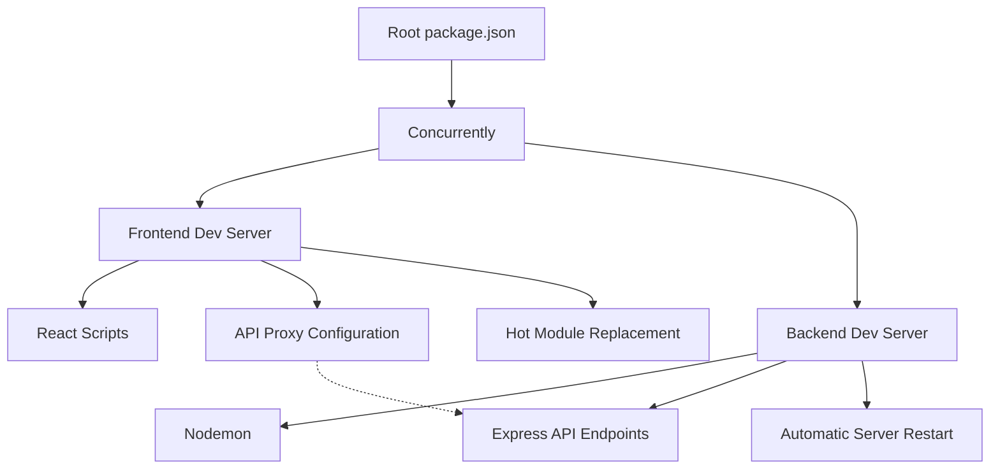

# Local Development Server Implementation

## Overview

This document details the implementation of the local development server environment for the Video Training Funnel website. It provides a comprehensive guide to the development server architecture, implementation details, and usage instructions.

## Table of Contents

1. [Architecture](#architecture)
2. [Features](#features)
3. [Implementation](#implementation)
4. [Configuration](#configuration)
5. [Usage Instructions](#usage-instructions)
6. [Error Handling & Logging](#error-handling--logging)
7. [Performance Optimization](#performance-optimization)
8. [Related Documentation](#related-documentation)

## Architecture

The local development environment consists of three main components:

1. **Frontend Development Server**: A React development server with hot reloading
2. **Backend Development Server**: A Node.js/Express server with automatic restart capability
3. **Orchestration Layer**: A system to run both servers concurrently and manage their lifecycle



## Features

### Frontend Development Server

- **Live Reloading**: Automatically refreshes the browser when code changes are detected
- **Hot Module Replacement**: Updates modules in-place without refreshing the entire page
- **Source Maps**: Enables accurate debugging in browser developer tools
- **ESLint Integration**: Real-time code quality feedback
- **API Proxy**: Routes API requests to the backend server, preventing CORS issues

### Backend Development Server

- **Automatic Restart**: Server restarts when files change
- **Environment Variables**: Configuration through `.env` files
- **Debugging Support**: Proper source maps for Node.js debugging
- **Logging**: Detailed logs for request/response monitoring
- **Custom Error Handling**: Developer-friendly error messages

### Orchestration Layer

- **Concurrent Execution**: Runs both servers simultaneously
- **Unified Terminal Output**: Combines logs from both servers
- **Lifecycle Management**: Starts and stops both servers together
- **Color-Coded Output**: Distinguishes between frontend and backend logs

## Implementation

### Directory Structure

```
project-root/
├── package.json              # Root package.json with concurrently
├── frontend/
│   ├── package.json          # Frontend dependencies & scripts
│   ├── public/
│   └── src/
├── backend/
│   ├── package.json          # Backend dependencies & scripts
│   ├── server.js             # Express server entry point
│   └── config/
│       └── .env              # Environment variables
```

### Root Package.json

```json
{
  "name": "video-training-funnel-dev",
  "version": "1.0.0",
  "description": "Development environment manager for the Video Training Funnel project",
  "private": true,
  "scripts": {
    "postinstall": "cd frontend && npm install && cd ../backend && npm install",
    "dev": "concurrently \"npm:start --prefix frontend\" \"npm:dev --prefix backend\""
  },
  "devDependencies": {
    "concurrently": "^9.1.2"
  }
}
```

### Frontend Package.json

```json
{
  "name": "frontend",
  "version": "0.1.0",
  "private": true,
  "proxy": "http://localhost:3001",
  "dependencies": {
    "@tanstack/react-query": "^5.74.4",
    "react": "^19.1.0",
    "react-dom": "^19.1.0",
    "react-router-dom": "^7.5.1",
    "react-scripts": "^5.0.1"
  },
  "scripts": {
    "start": "react-scripts start",
    "build": "react-scripts build",
    "test": "react-scripts test",
    "eject": "react-scripts eject"
  }
}
```

### Backend Package.json

```json
{
  "name": "backend",
  "version": "1.0.0",
  "description": "Backend for Video Training Funnel",
  "main": "server.js",
  "private": true,
  "dependencies": {
    "dotenv": "^16.5.0",
    "express": "^5.1.0",
    "jsonwebtoken": "^9.0.2",
    "mongoose": "^8.13.2",
    "nodemailer": "^6.10.1"
  },
  "devDependencies": {
    "nodemon": "^3.1.9"
  },
  "scripts": {
    "start": "node server.js",
    "dev": "nodemon server.js"
  }
}
```

### Backend Server.js

```javascript
// Basic Express server setup for development environment
// Provides a simple API endpoint and listens on a defined port.

require('dotenv').config(); // Load environment variables from .env file
const express = require('express');

const app = express();
const PORT = process.env.PORT || 3001; // Use port from .env or default to 3001

// Middleware to parse JSON bodies
app.use(express.json());

// Basic API route for health check
app.get('/api/health', (req, res) => {
  res.status(200).json({ status: 'UP', message: 'Backend server is running.' });
});

// Placeholder for other API routes (to be added in Phase 5)
// const apiRoutes = require('./routes/api-routes');
// app.use('/api', apiRoutes);

// Basic error handling middleware (can be expanded in ./middleware/error-handler.js)
app.use((err, req, res, next) => {
  console.error(err.stack);
  res.status(500).send('Something broke!');
});

app.listen(PORT, () => {
  console.log(`Backend server listening on port ${PORT}`);
});

// Basic logging (can be expanded using ./utils/logger.js)
console.log('Starting backend server...');
```

### Backend .env

```
# Backend Environment Variables Example

# Server Port (Default is 3001 if not specified)
PORT=3001

# MongoDB Connection String
DATABASE_URL="mongodb://localhost:27017/videoFunnelDB"

# JWT Secret Key (Replace with a strong, random string)
JWT_SECRET="YOUR_VERY_SECRET_KEY_REPLACE_ME"

# Email Service Configuration (Example for Nodemailer with Gmail)
# Ensure you use App Passwords if using Gmail with 2FA
EMAIL_HOST="smtp.gmail.com"
EMAIL_PORT=587
EMAIL_SECURE=false # true for 465, false for other ports
EMAIL_USER="your_email@gmail.com"
EMAIL_PASS="your_app_password"
EMAIL_FROM='"Your App Name" <your_email@gmail.com>'

# Add other environment-specific variables as needed
# e.g., API keys for third-party services
```

## Configuration

### Proxy Configuration

The frontend development server is configured to proxy API requests to the backend server. This is done through the `proxy` field in the frontend's `package.json`:

```json
{
  "proxy": "http://localhost:3001"
}
```

This means that any request to a path starting with `/api` will be proxied to the backend server at `http://localhost:3001`. For example, a fetch to `/api/health` from the frontend code will be routed to `http://localhost:3001/api/health` on the backend.

### Environment Variables

#### Frontend Environment Variables

Create a `.env` file in the `frontend` directory with the following variables:

```
REACT_APP_API_URL=http://localhost:3001/api
REACT_APP_VERSION=$npm_package_version
```

These variables are accessible in your React code as `process.env.REACT_APP_*`.

#### Backend Environment Variables

Create a `.env` file in the `backend` directory with the following variables (as shown above in the implementation section).

### Port Configuration

- Default frontend port: 3000 (can be changed with `PORT` environment variable)
- Default backend port: 3001 (can be changed in `backend/.env`)

## Usage Instructions

### Initial Setup

1. **Clone the Repository**:
   ```bash
   git clone <repository-url>
   cd video-training-funnel
   ```

2. **Install Dependencies**:
   ```bash
   npm install
   ```
   This will install dependencies for both frontend and backend, thanks to the `postinstall` script.

3. **Configure Environment Variables**:
   - Copy `backend/config/.env.example` to `backend/.env`
   - Modify the values as needed for your development environment

### Starting the Development Server

1. **Start Both Servers**:
   ```bash
   npm run dev
   ```
   This will start both the frontend and backend servers concurrently.

2. **Access the Application**:
   - Frontend: [http://localhost:3000](http://localhost:3000)
   - Backend API: [http://localhost:3001/api](http://localhost:3001/api)
   - Health Check: [http://localhost:3001/api/health](http://localhost:3001/api/health)

### Development Workflow

1. **Frontend Changes**:
   - Edit files in the `frontend/src` directory
   - The browser will automatically refresh to reflect your changes
   - For component-level changes, HMR will update without a full page refresh

2. **Backend Changes**:
   - Edit files in the `backend` directory
   - The server will automatically restart to reflect your changes
   - New API endpoints will be immediately available

3. **Stopping the Development Server**:
   - Press `Ctrl + C` in the terminal
   - Confirm the termination if prompted

## Error Handling & Logging

### Frontend Error Handling

The development server includes features to help identify and resolve errors:

- **Error Overlay**: Displays runtime errors in the browser
- **ESLint Warnings**: Appears in the browser console and terminal
- **Build Errors**: Displayed in the terminal and browser

To improve error handling, add a global error boundary component in `frontend/src/components/ErrorBoundary.jsx`:

```jsx
import React from 'react';

class ErrorBoundary extends React.Component {
  constructor(props) {
    super(props);
    this.state = { hasError: false, error: null, errorInfo: null };
  }

  static getDerivedStateFromError(error) {
    return { hasError: true };
  }

  componentDidCatch(error, errorInfo) {
    this.setState({ error, errorInfo });
    console.error("Error caught by boundary:", error, errorInfo);
  }

  render() {
    if (this.state.hasError) {
      return (
        <div className="error-boundary">
          <h2>Something went wrong.</h2>
          <details>
            <summary>Error Details</summary>
            <pre>{this.state.error && this.state.error.toString()}</pre>
            <pre>{this.state.errorInfo && this.state.errorInfo.componentStack}</pre>
          </details>
        </div>
      );
    }
    return this.props.children;
  }
}

export default ErrorBoundary;
```

Wrap your root App component with this error boundary in `frontend/src/index.js`.

### Backend Error Handling

The backend server includes basic error handling middleware that catches and logs unhandled errors. 

For more robust error handling, expand the error middleware in `backend/middleware/error-handler.js`:

```javascript
// Import the logger utility
const logger = require('../utils/logger');

// Custom error handling middleware
const errorHandler = (err, req, res, next) => {
  // Log the error
  logger.error(`Error: ${err.message}`, {
    stack: err.stack,
    path: req.path,
    method: req.method,
    body: req.body,
    params: req.params,
    query: req.query
  });

  // Determine status code
  const statusCode = err.statusCode || 500;
  
  // Error response
  const errorResponse = {
    success: false,
    error: {
      message: err.message || 'Internal Server Error',
      code: err.code || 'INTERNAL_SERVER_ERROR'
    },
    stack: process.env.NODE_ENV === 'development' ? err.stack : undefined
  };

  res.status(statusCode).json(errorResponse);
};

module.exports = errorHandler;
```

### Logging System

For enhanced logging, implement a logging utility in `backend/utils/logger.js`:

```javascript
const winston = require('winston');
const path = require('path');

// Define log format
const logFormat = winston.format.combine(
  winston.format.timestamp(),
  winston.format.json()
);

// Create logger instance
const logger = winston.createLogger({
  level: process.env.LOG_LEVEL || 'info',
  format: logFormat,
  defaultMeta: { service: 'video-training-backend' },
  transports: [
    // Console transport
    new winston.transports.Console({
      format: winston.format.combine(
        winston.format.colorize(),
        winston.format.simple()
      )
    }),
    // File transport for errors
    new winston.transports.File({
      filename: path.join(__dirname, '../logs/error.log'),
      level: 'error'
    }),
    // File transport for all logs
    new winston.transports.File({
      filename: path.join(__dirname, '../logs/combined.log')
    })
  ]
});

// Add request logger middleware
logger.requestLogger = (req, res, next) => {
  const start = Date.now();
  
  // Once the request is processed
  res.on('finish', () => {
    const duration = Date.now() - start;
    logger.info(`${req.method} ${req.originalUrl}`, {
      method: req.method,
      url: req.originalUrl,
      status: res.statusCode,
      duration: `${duration}ms`,
      ip: req.ip,
      userAgent: req.get('user-agent')
    });
  });
  
  next();
};

module.exports = logger;
```

## Performance Optimization

The development server includes several performance optimization features:

### Frontend Optimizations

- **Code Splitting**: Automatically splits code into manageable chunks
- **Hot Module Replacement**: Updates modules without refreshing the page
- **Asset Optimization**: Processes and optimizes static assets
- **Production Builds**: `npm run build` creates optimized production builds

### Backend Optimizations

- **Caching**: Implements caching where appropriate
- **Compression**: Enables gzip compression for responses
- **Request Limiting**: Protects against excessive requests
- **Memory Management**: Monitors and manages memory usage

### Development vs Production

The development server prioritizes developer experience with:
- Detailed error messages
- Source maps for debugging
- Hot reloading
- Verbose logging

For production, build and optimize with:
```bash
# Build frontend
cd frontend
npm run build

# Start backend in production mode
cd ../backend
NODE_ENV=production npm start
```

## Related Documentation

For more detailed information, refer to the following documents:

- [README.md](./README.md): Project overview and features
- [DEVELOPMENT.md](./DEVELOPMENT.md): Development workflow guidelines
- [IMPLEMENTATION-PLAN.md](./IMPLEMENTATION-PLAN.md): Detailed implementation phases
- [RESPONSIVE-DESIGN-PLAN.md](./RESPONSIVE-DESIGN-PLAN.md): Responsive design strategies
- [TESTING-PLAN.md](./TESTING-PLAN.md): Testing methodologies
- [TECHNICAL-ARCHITECTURE-DETAILED.md](./TECHNICAL-ARCHITECTURE-DETAILED.md): Complete technical architecture