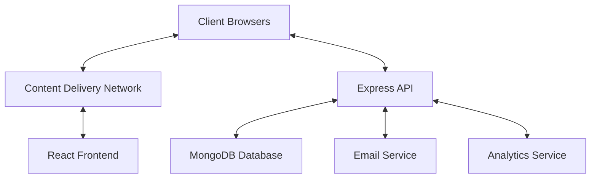
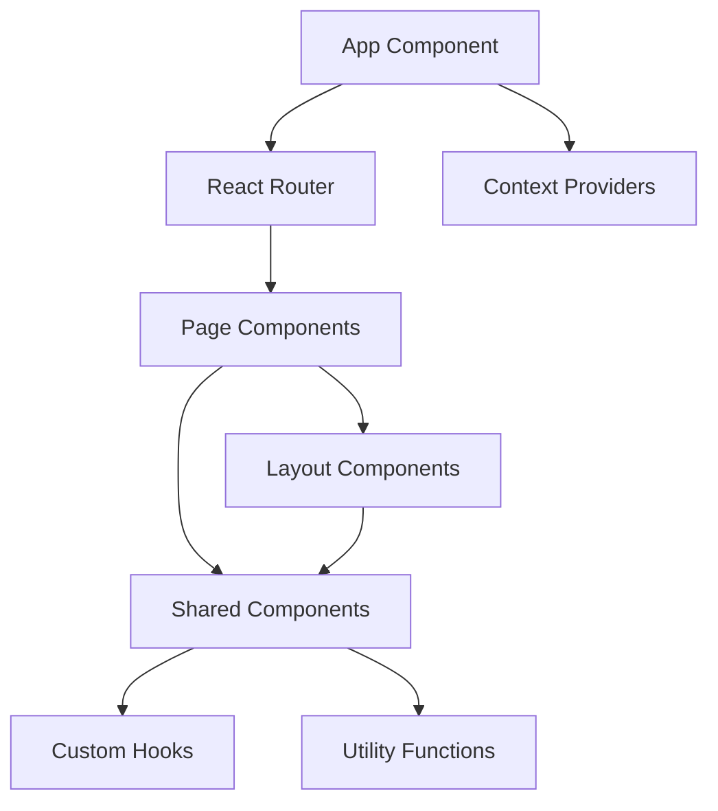
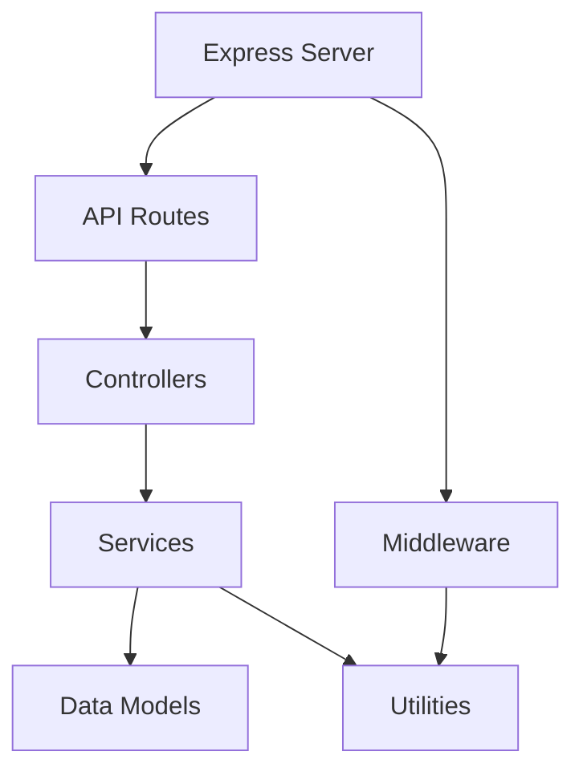
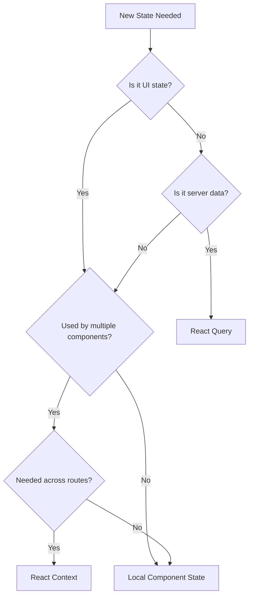
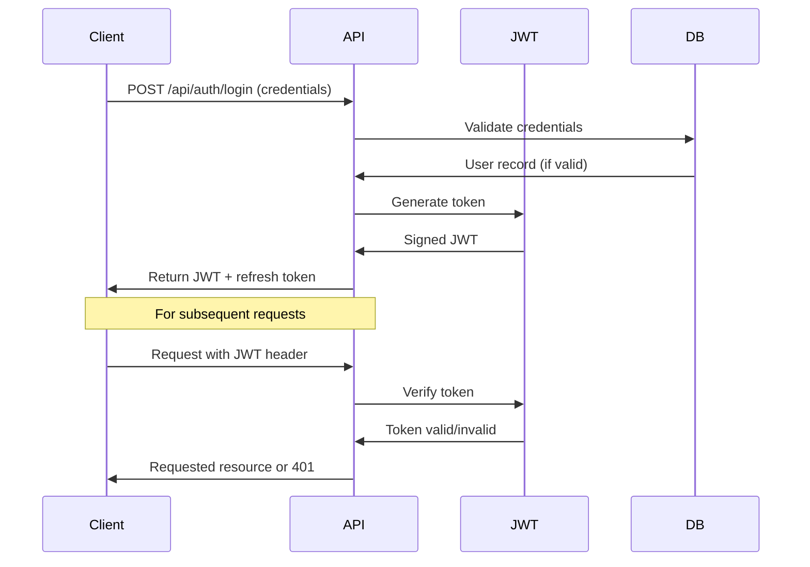
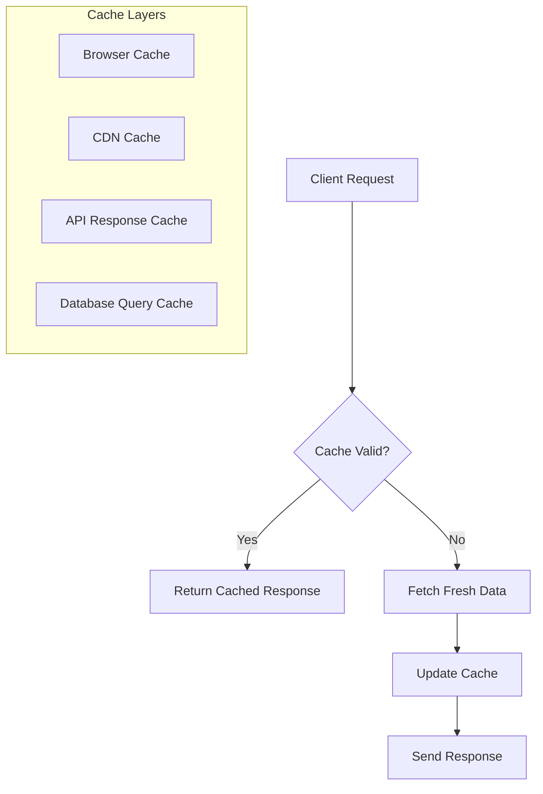
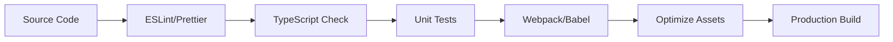
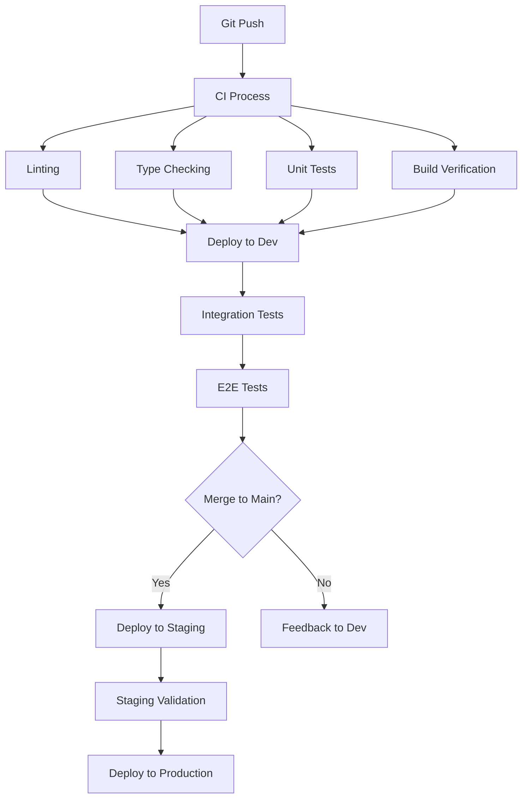

# Technical Architecture - Video Training Funnel Website

## Overview

This document details the technical architecture of the Video Training Funnel website. It provides in-depth specifications for the system architecture, component design patterns, data models, API endpoints, and technical implementation guidelines. This architecture is designed to create a maintainable, scalable, and performant application that meets all requirements outlined in the README.md.

## Table of Contents

1. [System Architecture](#system-architecture)
2. [Frontend Architecture](#frontend-architecture)
3. [Backend Architecture](#backend-architecture)
4. [Data Models](#data-models)
5. [API Design](#api-design)
6. [State Management](#state-management)
7. [Security Architecture](#security-architecture)
8. [Performance Optimization](#performance-optimization)
9. [Build & Deployment](#build--deployment)
10. [Technical Standards](#technical-standards)

## System Architecture

### High-Level Architecture



### Architecture Patterns

- **Client-Server Architecture**: Clear separation between frontend (React SPA) and backend (Express API)
- **Microservices-Inspired Modules**: Backend organized into loosely coupled services
- **RESTful API**: Standard HTTP methods and resource-based endpoints
- **MVC Pattern**: Model-View-Controller pattern for backend organization
- **Component-Based Architecture**: Frontend built with reusable, composable components
- **Responsive Design System**: Multi-device layout system based on viewport breakpoints

### Key Architectural Decisions

1. **Single Page Application**: React-based SPA for a seamless user experience
2. **API-First Backend**: RESTful API design for flexibility and potential future clients
3. **MongoDB Database**: Document-based storage for flexible schema evolution
4. **JWT Authentication**: Stateless authentication for scalability
5. **Context API + React Query**: Combined state management approach
6. **CSS Modules/Tailwind**: Component-scoped styling to prevent conflicts

## Frontend Architecture

### Component Architecture



### Component Design Principles

1. **Atomic Design Methodology**:
   - Atoms: Basic UI elements (buttons, inputs, icons)
   - Molecules: Simple component combinations (form fields, video controls)
   - Organisms: Complex components (video player, email capture form)
   - Templates: Page layouts without specific content
   - Pages: Complete pages with actual content

2. **Component Responsibilities**:
   - **Presentational Components**: Focus on UI rendering only
   - **Container Components**: Handle data fetching and state
   - **HOCs/Hooks**: Extract reusable logic
   - **Context Providers**: Manage shared state

3. **Component Props Interface**:
   - Clear, well-documented props
   - Default props where appropriate
   - Prop type validation
   - Callback props for component events

### Routing Architecture

```jsx
// Conceptual example of routing structure
<Routes>
  <Route path="/" element={<Layout />}>
    <Route index element={<LandingPage />} />
    <Route path="training-videos" element={<TrainingVideosPage />} />
    <Route path="thank-you" element={<ThankYouPage />} />
    <Route path="*" element={<NotFound />} />
  </Route>
</Routes>
```

### Code Organization

```
frontend/
├── public/
│   └── assets/
│       ├── images/
│       ├── fonts/
│       └── videos/
├── src/
│   ├── components/
│   │   ├── layout/     # Page structure components
│   │   ├── ui/         # Reusable UI components
│   │   ├── forms/      # Form-related components
│   │   └── video/      # Video player components
│   ├── pages/          # Page components
│   ├── hooks/          # Custom React hooks
│   ├── context/        # Context providers
│   ├── services/       # API interfaces & utilities
│   ├── utils/          # Helper functions
│   ├── styles/         # Global styles & variables
│   ├── constants/      # App constants
│   ├── types/          # TypeScript types/interfaces
│   ├── App.js          # Main app component
│   └── index.js        # Entry point
```

## Backend Architecture

### Server Architecture



### API Layer Organization

- **Routes**: Define API endpoints and route handlers
- **Controllers**: Handle request processing and response formatting
- **Services**: Contain business logic and data operations
- **Models**: Define data schema and database interactions
- **Middleware**: Implement cross-cutting concerns

### Middleware Chain

```mermaid
graph LR
    Request[Client Request] --> RequestLogger
    RequestLogger --> BodyParser
    BodyParser --> Cors
    Cors --> Authentication
    Authentication --> InputValidation
    InputValidation --> RouteHandler[Route Handler]
    RouteHandler --> ResponseFormatter
    ResponseFormatter --> ErrorHandler
    ErrorHandler --> Response[Client Response]
```



### Code Organization

```
backend/
├── server.js                # Entry point
├── config/                  # Configuration files
├── controllers/             # Request handlers
├── models/                  # Data models
├── routes/                  # API routes
├── middleware/              # Middleware functions
├── services/                # Business logic
├── utils/                   # Helper functions
└── tests/                   # Test files
```

## Data Models

### User Model

```javascript
const UserSchema = new mongoose.Schema({
  email: { 
    type: String, 
    required: true, 
    unique: true,
    trim: true,
    lowercase: true
  },
  firstName: { type: String, trim: true },
  lastName: { type: String, trim: true },
  registrationDate: { type: Date, default: Date.now },
  lastLogin: { type: Date },
  preferences: {
    notifications: { type: Boolean, default: true },
    marketingEmails: { type: Boolean, default: true }
  },
  status: {
    type: String,
    enum: ['active', 'inactive', 'suspended'],
    default: 'active'
  }
}, { timestamps: true });
```

### Lead Model

```javascript
const LeadSchema = new mongoose.Schema({
  email: { 
    type: String, 
    required: true,
    trim: true,
    lowercase: true
  },
  source: { 
    type: String,
    enum: ['landing_page', 'exit_intent', 'training_video', 'external'],
    required: true
  },
  captureDate: { type: Date, default: Date.now },
  ipAddress: { type: String },
  userAgent: { type: String },
  referrer: { type: String },
  converted: { type: Boolean, default: false },
  conversionDate: { type: Date },
  tags: [{ type: String }],
  metadata: { type: Map, of: String }
}, { timestamps: true });
```

### Video Interaction Model

```javascript
const VideoInteractionSchema = new mongoose.Schema({
  userId: { 
    type: mongoose.Schema.Types.ObjectId, 
    ref: 'User',
    sparse: true
  },
  sessionId: { type: String, required: true },
  videoId: { type: String, required: true },
  videoTitle: { type: String },
  watchStartTime: { type: Date, default: Date.now },
  watchEndTime: { type: Date },
  totalWatchTimeSeconds: { type: Number, default: 0 },
  percentageWatched: { 
    type: Number, 
    min: 0, 
    max: 100, 
    default: 0 
  },
  completed: { type: Boolean, default: false },
  interactions: [{
    type: { 
      type: String, 
      enum: ['play', 'pause', 'seek', 'volume_change', 'fullscreen', 'exit'] 
    },
    timestamp: { type: Date, default: Date.now },
    value: { type: String }
  }]
}, { timestamps: true });
```

## API Design

### RESTful Endpoints

#### User Endpoints

```
GET    /api/users/:id        - Get user by ID
POST   /api/users            - Create new user
PUT    /api/users/:id        - Update user details
DELETE /api/users/:id        - Delete user (soft delete)
```

#### Lead Endpoints

```
GET    /api/leads            - Get all leads (with pagination)
GET    /api/leads/:id        - Get lead by ID
POST   /api/leads            - Create new lead
PUT    /api/leads/:id        - Update lead details
DELETE /api/leads/:id        - Delete lead
```

#### Video Interaction Endpoints

```
GET    /api/video-interactions              - Get all interactions (with filtering)
GET    /api/video-interactions/:id          - Get interaction by ID
POST   /api/video-interactions              - Create interaction record
PUT    /api/video-interactions/:id          - Update interaction record
POST   /api/video-interactions/:id/event    - Record video interaction event
GET    /api/videos/:videoId/analytics       - Get analytics for specific video
```

### API Response Format

```json
{
  "success": true,
  "data": {
    // Requested data here
  },
  "meta": {
    "timestamp": "2024-04-19T10:00:00Z",
    "pagination": {
      "total": 100,
      "page": 1,
      "pageSize": 10,
      "totalPages": 10
    }
  }
}
```

### Error Response Format

```json
{
  "success": false,
  "error": {
    "code": "VALIDATION_ERROR",
    "message": "Email is required",
    "details": [
      {
        "field": "email",
        "message": "Email is required"
      }
    ]
  },
  "meta": {
    "timestamp": "2024-04-19T10:00:00Z"
  }
}
```

## State Management

### Client-Side State Management

1. **Local Component State**
   - For component-specific UI state
   - For form input state

2. **React Context API**
   - `UserContext`: User authentication and preferences
   - `VideoContext`: Video playback state and progress
   - Contains application-wide state

3. **React Query**
   - For server state management
   - Handles caching, background updates, and stale data

### State Management Decision Tree



### Context Providers Implementation

```jsx
// Example UserContext implementation
export const UserContext = createContext();

export function UserProvider({ children }) {
  const [user, setUser] = useState(null);
  const [isLoading, setIsLoading] = useState(true);
  
  async function login(credentials) {
    // Implementation
  }
  
  async function logout() {
    // Implementation
  }
  
  useEffect(() => {
    // Check for existing session
  }, []);
  
  return (
    <UserContext.Provider value={{ user, isLoading, login, logout }}>
      {children}
    </UserContext.Provider>
  );
}
```

## Security Architecture

### Authentication Flow



### Security Measures

1. **Authentication**
   - JWT-based authentication
   - Refresh token rotation
   - Secure, HttpOnly cookies

2. **API Security**
   - HTTPS enforcement
   - CORS configuration
   - Rate limiting
   - Request size limiting

3. **Data Protection**
   - Input validation
   - Parameterized queries
   - XSS protection
   - CSRF protection

4. **Infrastructure Security**
   - Dependency security scanning
   - Regular security updates
   - Environment variable management
   - Principle of least privilege

## Performance Optimization

### Frontend Optimizations

1. **Code Splitting**
   - Route-based code splitting
   - Component lazy loading
   - Dynamic imports for large modules

2. **Resource Optimization**
   - Image optimization and responsive images
   - Video delivery optimization
   - Font loading optimization
   - CSS optimization

3. **Rendering Optimization**
   - Memoization with React.memo, useMemo, useCallback
   - Virtualization for long lists
   - Windowing techniques for large datasets
   - Skeleton screens for loading states

### Backend Optimizations

1. **Database Optimization**
   - Proper indexing strategy
   - Query optimization
   - Pagination for large datasets
   - Caching frequently accessed data

2. **API Optimization**
   - Response compression
   - Optimized JSON serialization
   - ETags for caching
   - Connection pooling

3. **Server Optimization**
   - Horizontal scaling
   - Load balancing
   - Memory and CPU profiling
   - Logging optimization

### Caching Strategy



## Build & Deployment

### Build Process



### CI/CD Pipeline



### Deployment Environments

| Environment | Purpose | Update Frequency | Access |
|-------------|---------|------------------|--------|
| Development | Active development | Continuous | Development team |
| Staging | Pre-production testing | After feature completion | Internal stakeholders |
| Production | Live application | Scheduled releases | Public |

### Container Strategy

```dockerfile
# Example Dockerfile for Frontend
FROM node:16-alpine as build
WORKDIR /app
COPY package*.json ./
RUN npm ci
COPY . .
RUN npm run build

FROM nginx:alpine
COPY --from=build /app/build /usr/share/nginx/html
COPY nginx.conf /etc/nginx/conf.d/default.conf
EXPOSE 80
CMD ["nginx", "-g", "daemon off;"]
```

## Technical Standards

### Code Style

- Follow Airbnb JavaScript Style Guide
- ESLint and Prettier enforced via pre-commit hooks
- Component naming: PascalCase
- File naming conventions:
  - Components: PascalCase.jsx
  - Utilities: camelCase.js
  - Tests: *.test.js

### Documentation Standards

- JSDoc comments for functions and components
- README.md for each major directory
- API documentation with OpenAPI/Swagger
- Component Storybook documentation

### Commit Guidelines

- Semantic commit messages (feat, fix, docs, style, refactor, test, chore)
- Husky pre-commit hooks for linting and testing
- Pull request templates with checklist

### Quality Standards

- Unit test coverage: 80%+ (enforced by CI)
- Integration test coverage for critical paths
- Accessibility compliance: WCAG 2.1 AA
- Performance budget enforcement
- Security scanning in CI pipeline

## Appendix

### Technology Stack Details

#### Frontend
- React 18+
- React Router v6+
- React Query
- Context API
- CSS Modules / Tailwind CSS
- Jest + React Testing Library
- Cypress for E2E testing

#### Backend
- Node.js 16+
- Express.js
- MongoDB
- Mongoose ODM
- JWT Authentication
- Nodemailer
- Winston logger

#### DevOps
- Docker
- NGINX
- GitHub Actions / CircleCI
- AWS / Azure / GCP