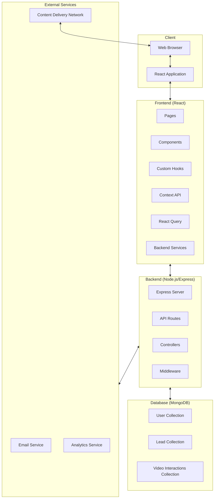
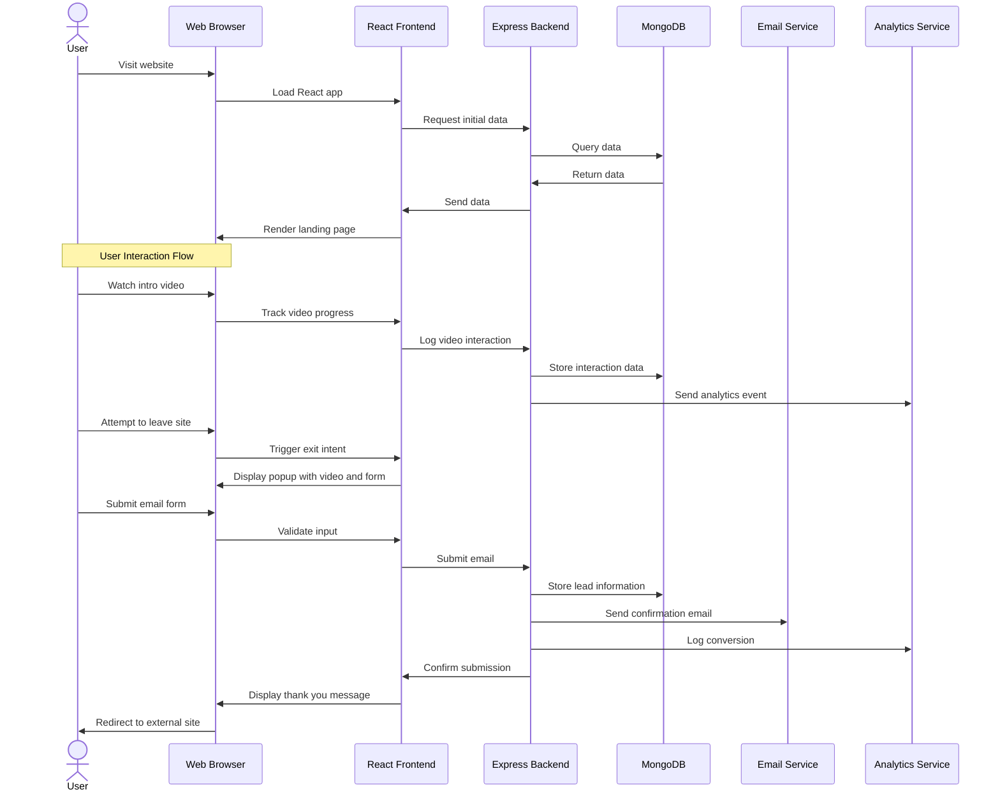
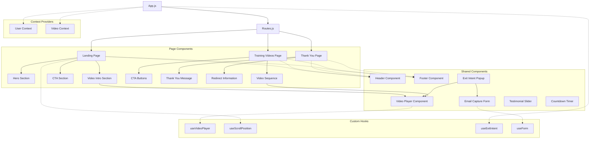
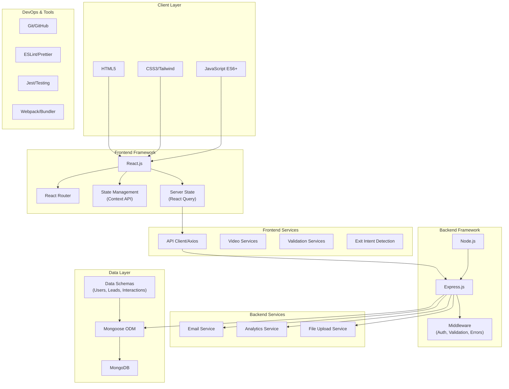
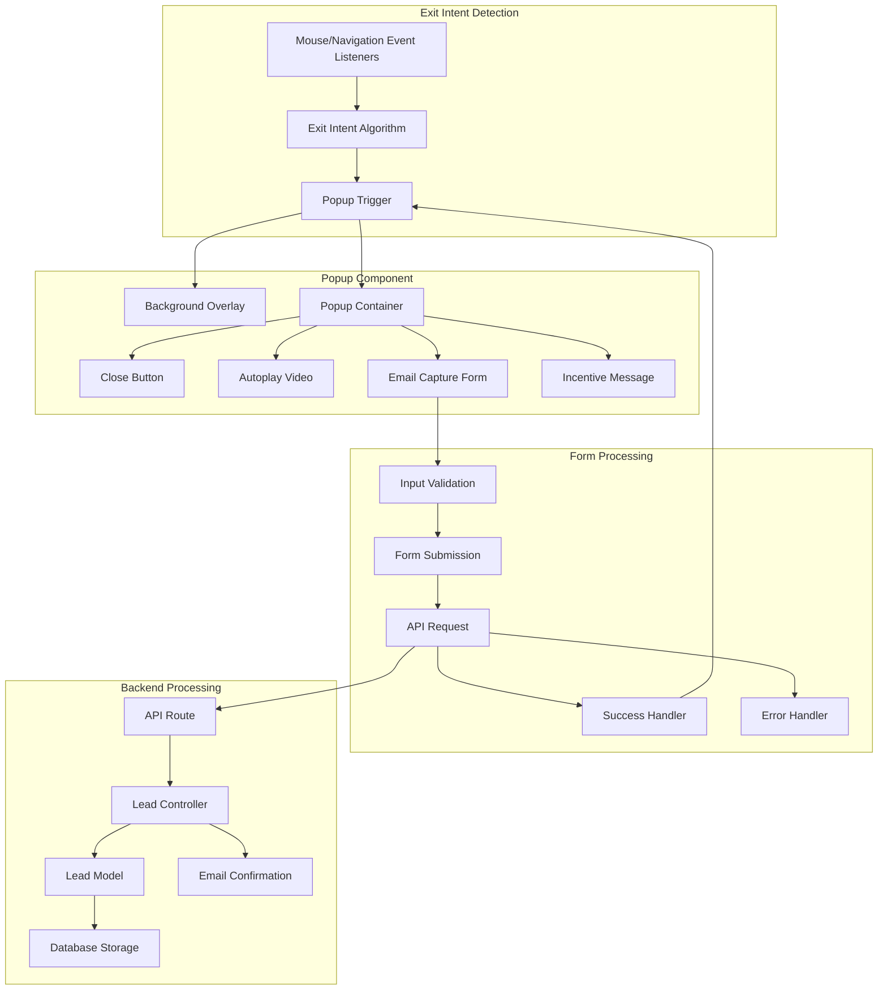
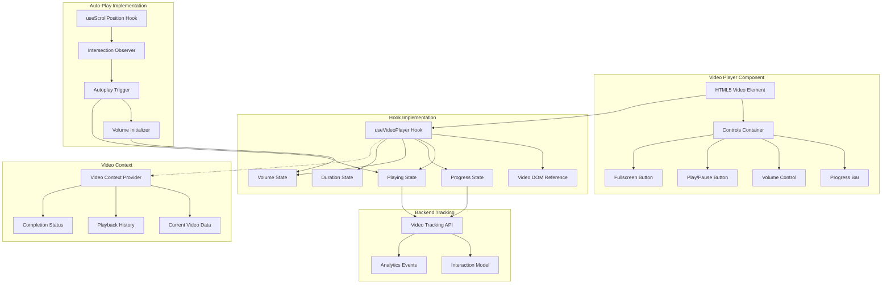
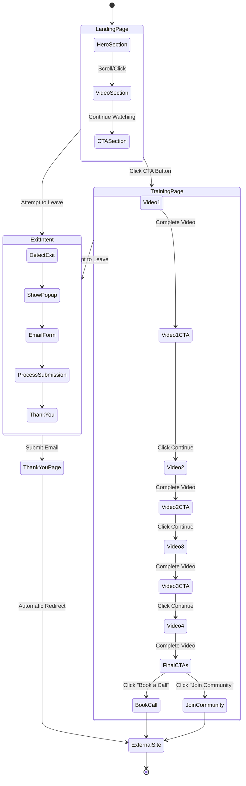
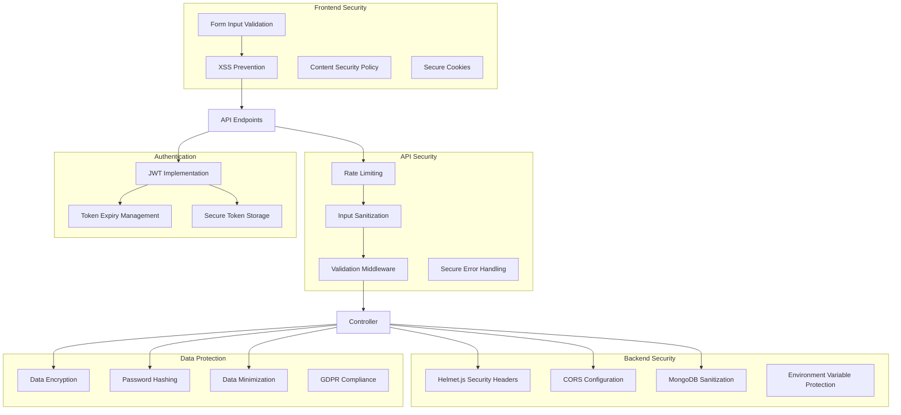

# Video Training Funnel Website - Technical Architecture

This document provides a visual representation of the system architecture, data flows, and component relationships for the video training funnel website.

## System Architecture Overview

## Data Flow Diagram

## Component Architecture

## Technology Stack Architecture

## Exit Intent Popup Implementation

## Video Player Architecture

## User Journey Flow

## Security Measures

This technical architecture provides a comprehensive visualization of how the various components of the video training funnel website interact with each other, from high-level system architecture down to specific implementation details for core features like the exit intent popup and video player.