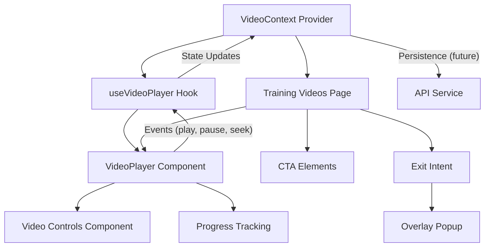

# Video Player System Documentation

## Overview

This document provides comprehensive documentation for the Video Training Funnel website's video player system. The system enables sequential video training delivery with custom controls, tracking, and integrated call-to-action elements.

## Table of Contents

1. [System Architecture](#system-architecture)
2. [Component Structure](#component-structure)
3. [State Management](#state-management)
4. [User Interface](#user-interface)
5. [Event Handling](#event-handling)
6. [Implementation Details](#implementation-details)
7. [Integration Points](#integration-points)
8. [Technical Requirements](#technical-requirements)
9. [Responsive Design](#responsive-design)
10. [Accessibility Considerations](#accessibility-considerations)

## System Architecture

The video player system follows a layered architecture:



### Key Design Principles

1. **Separation of Concerns**:
   - Context layer manages global video state
   - Hook layer handles video-specific logic
   - Component layer handles rendering and user interaction

2. **State Centralization**:
   - All video data flows through VideoContext
   - Components remain stateless where possible

3. **Extensibility**:
   - Modular components allow for future feature additions
   - Clear integration points for analytics and backend services

## Component Structure

### Core Components

#### 1. VideoContext (`/src/context/VideoContext.js`)

The central state management system for all video data and operations:

```javascript
// Key functionality provided:
// - Current video tracking
// - Video list management
// - Play state management
// - Navigation between videos
// - Progress tracking
```

#### 2. useVideoPlayer Hook (`/src/hooks/useVideoPlayer.js`)

Custom hook that bridges VideoContext with the HTML5 video element:

```javascript
// Key functionality provided:
// - Video element reference management
// - Event binding (play, pause, timeupdate, etc.)
// - Playback control functions
// - Seeking and progress reporting
// - Volume and playback rate management
```

#### 3. VideoPlayer Component (`/src/components/video/VideoPlayer.jsx`)

The visual video player with custom controls:

```javascript
// Key functionality provided:
// - Video rendering with HTML5 video element
// - Custom controls overlay
// - Progress bar with seeking
// - Volume controls
// - Fullscreen toggle
```

#### 4. TrainingVideosPage (`/src/pages/TrainingVideosPage.jsx`)

Container for the video player and CTA elements:

```javascript
// Key functionality provided:
// - Video player integration
// - Sequential navigation UI
// - CTA button display and management
// - "Leave" button to trigger exit intent
```

## State Management

### Video Context State Structure

```javascript
{
  videos: [    // Array of video objects
    {
      id: 'vid1',
      title: 'Training Video 1',
      src: '/assets/videos/video1.mp4',
      duration: 300,     // in seconds
      watched: false,    // completion status
      progress: 0        // percentage (0-100)
    },
    // Additional videos...
  ],
  currentVideoIndex: 0,  // Index of current video in array
  isPlaying: false,      // Current playback state
  volume: 0.5,           // Volume level (0-1)
  playbackRate: 1,       // Playback speed
  error: null           // Any error state
}
```

### State Update Flow

1. User interaction triggers component event handler
2. Component calls hook method
3. Hook updates HTML5 video element and calls context method
4. Context updates global state
5. Components re-render with new state

## User Interface

### Video Player UI Components

1. **Main Video Display**:
   - 16:9 aspect ratio container
   - Centered in available space
   - Responsive sizing based on viewport

2. **Control Bar**:
   - Play/Pause toggle
   - Progress bar with seek functionality
   - Volume control
   - Time display (current/total)
   - Optional: fullscreen toggle

3. **Training Video Navigation**:
   - Title display
   - "Leave" button (triggers exit intent overlay)
   - CTA button (customized per video)
   - Dual CTA for final video (Book Call/Join Community)

### UI States

1. **Loading State**:
   - Displayed when video is initializing
   - Shows loading indicator

2. **Play State**:
   - Controls fade out after a few seconds
   - Reappear on mouse movement

3. **Pause State**:
   - Controls remain visible
   - Play button prominently displayed

4. **Error State**:
   - Error message displayed
   - Retry option where applicable

## Event Handling

### Video Element Events

| Event | Handler | Action |
|-------|---------|--------|
| `loadedmetadata` | `handleLoadedMetadata` | Sets duration, enables controls |
| `timeupdate` | `handleTimeUpdate` | Updates current time, reports progress |
| `ended` | `handleVideoEnd` | Marks video as watched, enables next video |
| `play` | `handlePlay` | Updates playing state |
| `pause` | `handlePause` | Updates playing state |
| `error` | `handleError` | Sets error state, shows error UI |

### User Interaction Events

| Interaction | Handler | Action |
|-------------|---------|--------|
| Click Play | `togglePlay` | Plays/pauses video |
| Click Progress Bar | `seek` | Jumps to position |
| Drag Progress Bar | `startSeeking`, `endSeeking` | Handles seek operations |
| Change Volume | `setVolume` | Adjusts volume level |
| Click Leave | `handleLeaveClick` | Triggers exit intent popup |
| Click CTA | `handleCTAClick` | Performs video-specific action |

## Implementation Details

### VideoPlayer Component Implementation

```jsx
// Simplified structure
function VideoPlayer() {
  const videoRef = useRef(null);
  const playerState = useVideoPlayer(videoRef);
  
  return (
    <div className="video-player-container">
      <video ref={videoRef} />
      
      <div className="video-controls">
        <button onClick={playerState.togglePlay}>
          {playerState.isPlaying ? 'Pause' : 'Play'}
        </button>
        
        <input 
          type="range" 
          value={playerState.currentTime}
          max={playerState.duration}
          onChange={e => playerState.seek(parseFloat(e.target.value))}
        />
        
        <div className="time-display">
          {formatTime(playerState.currentTime)} / {formatTime(playerState.duration)}
        </div>
        
        <input 
          type="range"
          value={playerState.volume}
          min="0"
          max="1"
          step="0.05"
          onChange={e => playerState.setVolume(parseFloat(e.target.value))}
        />
      </div>
    </div>
  );
}
```

### TrainingVideosPage CTA Implementation

```jsx
// Simplified structure
function TrainingVideosPage() {
  const { 
    currentVideo, 
    currentVideoIndex, 
    videos,
    nextVideo
  } = useVideo();
  
  const [showExitPopup, setShowExitPopup] = useState(false);
  const isLastVideo = currentVideoIndex === videos.length - 1;
  
  const handleLeaveClick = () => {
    setShowExitPopup(true);
  };
  
  return (
    <div className="training-videos-page">
      <h1>{currentVideo.title}</h1>
      <VideoPlayer />
      
      <div className="cta-section">
        <button 
          className="leave-button"
          onClick={handleLeaveClick}
        >
          Leave
        </button>
        
        {!isLastVideo ? (
          <button className="cta-button">
            {/* Video-specific CTA text */}
          </button>
        ) : (
          <div className="dual-cta">
            <button className="primary-cta">Book a Call</button>
            <button className="secondary-cta">Join Community</button>
          </div>
        )}
      </div>
      
      {/* Exit Intent Popup */}
      {showExitPopup && (
        <ExitIntentPopup 
          isOpen={showExitPopup}
          onClose={() => setShowExitPopup(false)}
        />
      )}
    </div>
  );
}
```

## Integration Points

### 1. Backend Integration (Future)

The video player system is designed to connect with backend APIs for:

- Progress tracking and resumption
- Analytics data collection
- User behavior analysis
- Video metadata retrieval

Implementation will be through API service calls:

```javascript
// Example future implementation
const reportProgress = async (videoId, progress) => {
  try {
    await apiService.post('/api/video-interactions', {
      videoId,
      progress,
      timestamp: new Date().toISOString()
    });
  } catch (error) {
    console.error('Failed to report progress:', error);
    // Continue playback even if reporting fails
  }
};
```

### 2. Exit Intent System Integration

The video player system connects with the exit intent system:

- "Leave" button directly triggers the exit intent popup
- Exit detection during video playback is managed by global exit intent service

### 3. Analytics Integration (Future)

Designed to track key metrics:

- Play/pause frequency
- Progress milestones (25%, 50%, 75%, 100%)
- Time spent watching
- CTA engagement
- Abandonment points

## Technical Requirements

### Browser Compatibility

- Chrome (latest 2 versions)
- Firefox (latest 2 versions)
- Safari (latest 2 versions)
- Edge (latest version)
- iOS Safari and Chrome
- Android Chrome

### Performance Targets

- Initial load time: < 1.5s
- Time to first frame: < 0.5s
- Seek response time: < 0.2s
- Memory usage: < 50MB for video player

### Video Format Support

- MP4 (H.264) as primary format
- WebM as fallback for broad compatibility
- Support for multiple quality levels (future)

## Responsive Design

### Breakpoints

Following project-wide breakpoint strategy:

```css
/* Mobile (Portrait): 320px - 479px */
@media screen and (max-width: 479px) { ... }

/* Mobile (Landscape): 480px - 767px */
@media screen and (min-width: 480px) and (max-width: 767px) { ... }

/* Tablet: 768px - 1023px */
@media screen and (min-width: 768px) and (max-width: 1023px) { ... }

/* Desktop: 1024px - 1439px */
@media screen and (min-width: 1024px) and (max-width: 1439px) { ... }

/* Large Desktop: 1440px+ */
@media screen and (min-width: 1440px) { ... }
```

### Component Adaptations

1. **Video Player**:
   - Maintains 16:9 aspect ratio on all devices
   - Controls enlarge on touch devices for better usability
   - Fullscreen option prominent on mobile

2. **CTA Buttons**:
   - Stack vertically on mobile screens
   - Increase size for touch targets
   - Maintain consistent visibility

3. **Navigation Elements**:
   - Simplified layout on smaller screens
   - Touch-friendly spacing
   - "Leave" button remains easily accessible

## Accessibility Considerations

### WCAG 2.1 AA Compliance

1. **Keyboard Navigation**:
   - All controls accessible via keyboard
   - Tab order follows logical sequence
   - Focus states clearly visible

2. **Screen Reader Support**:
   - ARIA attributes on all controls
   - Descriptive labels for all buttons
   - Time information accessible to screen readers

3. **Captions**:
   - Support for WebVTT captions
   - Customizable caption styling
   - Toggling UI accessible to screen readers

### Implementation Examples

```jsx
// Accessible play button example
<button 
  onClick={togglePlay}
  aria-label={isPlaying ? "Pause video" : "Play video"}
  aria-pressed={isPlaying}
>
  {isPlaying ? "Pause" : "Play"}
</button>

// Accessible progress slider
<input
  type="range"
  min="0"
  max={duration}
  value={currentTime}
  onChange={handleSeek}
  aria-label="Video progress"
  aria-valuemin="0"
  aria-valuemax={duration}
  aria-valuenow={currentTime}
  aria-valuetext={`${formatTime(currentTime)} of ${formatTime(duration)}`}
/>
```

## Next Steps & Future Enhancements

1. **Quality Selection**:
   - Add support for multiple quality streams
   - Implement adaptive bitrate selection

2. **Advanced Analytics**:
   - Heatmaps of user engagement
   - A/B testing of video content

3. **Playback Enhancements**:
   - Bookmarking functionality
   - Notes and annotations

4. **Integration Expansion**:
   - LMS system integration
   - Certificate generation upon completion

---

This documentation provides a comprehensive overview of the Video Player System. Refer to individual component files for detailed implementation specifics.